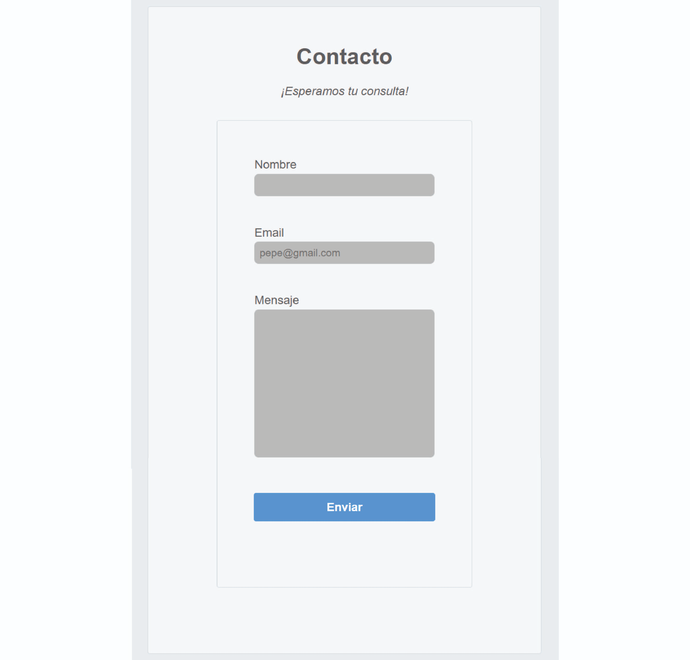
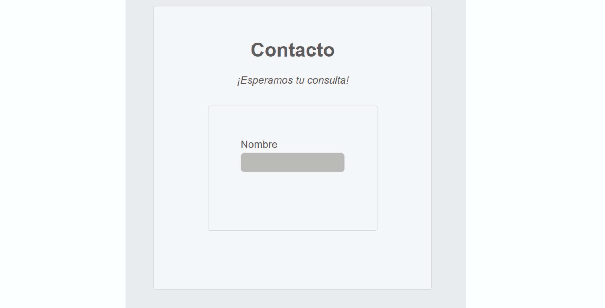
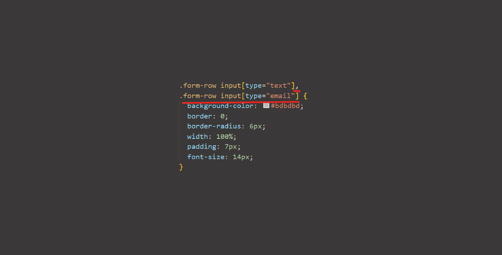
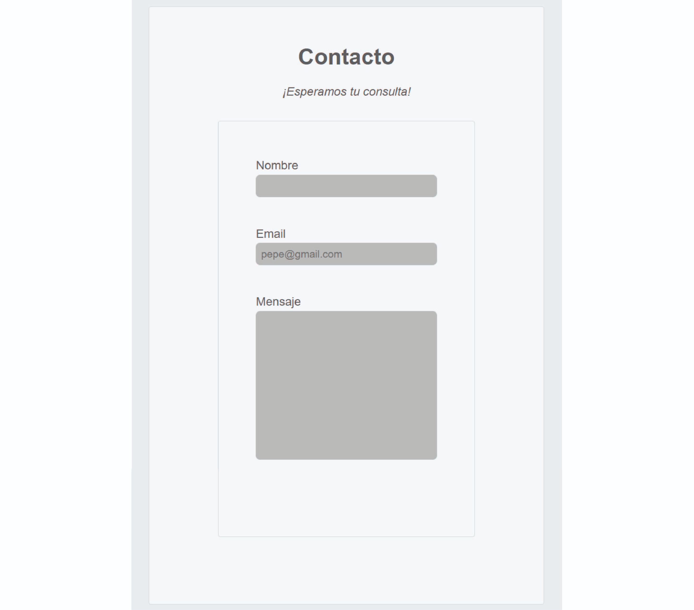

# clase_09
# 👣 Paso 24 - ¡Continuamos con Javascript!


## 👋 ¡Bienvenido a tu siguiente paso! 
En el paso anterior comenzamos a poner en práctica los primeros códigos con Javascript. Ahora vamos a ver otros conceptos.

¡Continuemos! 🚀

💡 Para este paso, les vamos a pedir que:

🔸Resuelvan individualmente el ejercicio en su propia computadora.

🔸Preguntar a tus compañeros en caso de no entender alguna parte. 

🔸Si no logran resolver algo entre todos, no olviden llamar al mentor para que los ayude. 

📌 ¡Recuerden mantener las cámaras encendidas en todo el proceso! ¡Sé protagonista de tus objetivos!

✏️ Actividad - Condicionales en Javascript
📌 Mira el siguiente video dónde mostramos cómo hacer condicionales en Javascript

https://youtu.be/c7_Q5qOASdc

➕ Vamos a continuar trabajando en el archivo script.js

Crea un condicional que modifique el texto del elemento “Acerca de mí” dependiendo de si la condición se cumple o no se cumple.

🖥️ Cuando todos hayan logrado seguir las instrucciones, de a uno vayan compartiendo pantalla mostrando su código y el resultado de su código.

✏️ Actividad - Funciones en Javascript

📌 Mira el siguiente video dónde mostramos cómo hacer funciones en Javascript

https://youtu.be/z9ydd8ekpzY
➕ Vamos a continuar trabajando en el archivo script.js

Crea un condicional que modifique el texto del elemento “Acerca de mí” dependiendo de si la condición se cumple o no se cumple.

🖥️ Cuando todos hayan logrado seguir las instrucciones, de a uno vayan compartiendo pantalla mostrando su código y el resultado de su código.

✏️ Actividad - Funciones en Javascript

📌 Mira el siguiente video dónde mostramos cómo hacer funciones en Javascript
https://youtu.be/z9ydd8ekpzY

➕ Vamos a continuar trabajando en el archivo script.js

Crea una función que modifique el texto del elemento “Acerca de mí” definiendo previamente en la función el texto que quiero utilizar. 

🖥️ Cuando todos hayan logrado seguir las instrucciones, de a uno vayan compartiendo pantalla mostrando su código y el resultado de su código. 

## ✏️ Actividad - Menú mobile en Javascript

Descarga la siguiente carpeta dentro de tu compu, y colócala dentro de la carpeta de PWDC 👉Link Carpetas

Abre el archivo nav.html con el liver server y revisa cómo se ve el menú achicando la pantalla del navegador

📌 Verás que al hacer click aún no sucede nada. Y esto es porque vamos a aplicar un código Javascript para que funcione el menú. 

Crear un archivo script.js y linkealo al archivo nav.html

Copia el siguiente código Javascript en el archivo script.js

```
      let menu_responsive = document.querySelector(".checkbtn");
      menu_responsive.onclick = function () {
        navBar = document.querySelector(".navbar");
        navBar.classList.toggle("active");
      };
```
Ahora, al hacer click deberías ver cómo se despliega el menú. Pero ¿Qué hace este código?

Lo veremos en el siguiente video:

https://youtu.be/LmaS1skvOHk 

5. Ahora apliquen el script al menú de su web. Van a tener que modificar el CSS anterior para que se adapte al script.

## ✨ Video complementario
Les compartimos este video complementario sobre 👉 Cómo manipular el DOM con JavaScript . En el mismo van a ver más formas de cómo manipular el DOM. Dura 47 minutos, por lo que les proponemos que lo vean con calma en sus casas para analizarlo y practicar.

✅ Checklist
Asegúrate de:

Revisar cómo se escriben condiciones en Javascript

Revisar cómo se utilizan funciones en Javascript

💡 Revisar estos puntos es muy importante dado que ayudarán a que todos puedan tener la mejor experiencia posible y logren resolver los desafíos correspondientes. 

🔎 Resumen y buenas prácticas aprendidas
Javascript es un lenguaje muy amplio, aquí veremos partes para aplicar a la web

El DOM es una representación de la estructura de un documento HTML en el navegador

Javascript permite agregar dinamismo a las páginas web

## 📓 Test
Por último, te proponemos realizar un muy breve test para poner a prueba los aprendizajes alcanzados. Vamos 🚀

https://eggeducacion.typeform.com/to/KjOv1jOI#form_type=autoevaluacion&profile_id=65124ef5f615c80f596b9c98&step_id=3kMHMmttAZlPpajgte0khi&module_id=1aVJePrGRBrkp5WrfPIzbW&section_id=PpzNNBsxH0TZG9S1IENad

⏭️ En el próximo encuentro veremos cómo hacer formularios y validarlos utilizando Javascript

Si queres colaborar o sugerir algun cambio en este paso, hacelo 👉 aquí.

# 🏠 Paso 25 - ¡Formularios!


## 👋 ¡Bienvenido a tu siguiente paso! 
¡Hola! Seguimos avanzando 👟

En los pasos previos vimos cómo agregar interactividad al sitio con Javascript y algunos conceptos básicos. 

Ahora vamos a ver cómo armar formularios en HTML y validarlos con Javascript. 

¿Listo? ¡Vamos! 🚀

## 📖 Material descargable
Aquí es donde encontrarás el material descargable que complementará los ejercicios prácticos que vamos a ver en los siguientes pasos. 

Para tu primer encuentro en vivo tienes que leer solo el material que te compartimos a continuación 👉 Formularios
[Documwnto](documentos/09%20-%20Formularios.pdf)
📢 ¡Importante!

No debes memorizar, concéntrate en entender el concepto. La práctica hará que luego puedas aplicarlo con más agilidad.

Si hay algo que no comprendes, ¡no te preocupes! Anótalo y pregunta a tus compañeros en el encuentro en vivo.

✍️ Para tu próximo encuentro en vivo
En esta ocasión te dejamos el siguiente material 👉 Mi primer formulario HTML (https://developer.mozilla.org/es/docs/Learn/Forms/Your_first_form). Te pedimos que lo leas y analices para entender qué elementos componen un formulario en HTML. 

✅ Checklist
Asegúrate de:

Leer la teoría

Ver el material sobre formularios 

💡 Revisar estos puntos es muy importante dado que ayudarán a que todos puedan tener la mejor experiencia posible y logren resolver los desafíos correspondientes. 

Si queres colaborar o sugerir algun cambio en este paso, hacelo 👉 aquí.

# 👣 Paso 26 - ¡A trabajar en equipo!


## 👋 ¡Bienvenido a tu siguiente paso! 
Llegó el momento de practicar formularios para luego aplicarlo a tu página web. 

¡Continuemos! 🚀

💡 Para este paso, les vamos a pedir que:

🔸Resuelvan individualmente el ejercicio en su propia computadora.

🔸Preguntar a tus compañeros en caso de no entender alguna parte. 

🔸Si no logran resolver algo entre todos, no olviden llamar al mentor para que los ayude. 

📌 ¡Recuerden mantener las cámaras encendidas en todo el proceso! ¡Sé protagonista de tus objetivos!

✏️ Actividad - Creando mi primer formulario
Para comenzar con la creación de formularios, la primera recomendación es pensar previamente qué campos van a querer en su formulario y cómo van a querer que luzca en la web.

En este caso vamos a armar un formulario que luzca de la siguiente manera


Vamos a comenzar con la creación del formulario siguiendo estos pasos:

1. Crear una nueva carpeta con nombre formulario (al mismo nivel de la carpeta de mi_primera_web). 

2. Crear dos archivos, forms.html y styles.css, y vincular el documento de estilos en el documento html

➕ `<form>` - Todo formulario comienza con la etiqueta `<form></form> `y puede recibir múltiples atributos. Los dos más importantes son action y method.  

Action: indica a qué web se enviará la información (para este ejemplo lo dejaremos vacío)

Method: es el método mediante el cuál viaja la información al servidor. Y esto dependerá de cómo el programador quiera manejar esta opción. En general se utilizan dos métodos GET o POST. A fines prácticos para este ejemplo usaremos GET,

3. Copia el siguiente código HTML en tu archivo forms.html
```
<!DOCTYPE html>
<html lang="en">
  <head>
    <meta charset="UTF-8" />
    <title>Speaker Submission</title>
    <link rel="stylesheet" href="styles.css" />
  </head>
  <body>
    <footer class="form-header">
      <h1>Contacto</h1>
      <p><em>¡Esperamos tu consulta!</em></p>

      <form action="" method="get" class="formulario"></form>
    </footer>
  </body>
</html>
```
4. Agrega estos estilos CSS a tu archivo styles.css

```
/* ------------- CSS General ------------- */
* {
  margin: 0;
  padding: 0;
  box-sizing: border-box;
}

body {
  color: #5d6063;
  background-color: #eaedf0;
  font-family: "Helvetica", "Arial", sans-serif;
  font-size: 16px;
}

/* ------------- Encabezado Contacto ------------- */

footer {
  display: flex;
  flex-direction: column;
  align-items: center;
}

.form-header {
  text-align: center;
  background-color: #f6f7f8;
  border: 1px solid #d6d9dc;
  border-radius: 3px;

  width: 80%;
  margin: 10px auto;
  padding: 50px;
}

.form-header h1 {
  font-size: 30px;
  margin-bottom: 20px;
}

/* ------------- Formulario ------------- */

.formulario {
  background-color: #f6f7f8;
  border: 1px solid #d6d9dc;
  border-radius: 3px;

  width: 80%;
  padding: 50px;
  margin: 30px 0 40px 0;
}
```
➕ `<input> y <label>` (para ingresar textos) - El campo donde el usuario ingresa información es el campo ` <input/>` y si queremos que el campo tenga un título, tendremos que usar la etiqueta `<label></label>`. 

Para los campos de texto utilizaremos type="text"

5. Agrega el siguiente html dentro de la etiqueta `<form></form>`

```
<div class="form-row">
          <label for="nombre">Nombre</label>
          <input id="nombre" name="nombre" type="text" />
        </div>
```
💡Importante: el atributo for de la etiqueta label, debe coincidir con el atributo id del elemento input. Para que estén vinculados.

6. Agregar el siguiente código CSS en styles.css

```
/* ------------- Campos del Formulario ------------- */

.form-row {
  margin-bottom: 40px;
  display: flex;
  justify-content: flex-start;
  flex-direction: column;
  flex-wrap: wrap;
}

.form-row input[type="text"] {
  background-color: #bdbdbd;
  border: 0;
  border-radius: 6px;
  width: 100%;
  padding: 7px;
  font-size: 14px;
}

.form-row label {
  margin-bottom: 3px;
  text-align: initial;
}
```

📌Revisa el código CSS. Estamos usando las propiedades y valores que ya vimos, como flex, margin, padding, width, etc. 

📌input[type="text"] → Este selector en CSS es un selector de atributo que aplica el CSS a los elementos que sean input de tipo text.

🛑✋ Hasta aquí deberían ver lo siguiente:


Pueden agregar el siguiente estilo CSS para adaptar el formulario a resoluciones de más de 700px

```
/* ------------- Para Pantallas de más de 700px ------------- */
@media only screen and (min-width: 700px) {
  .form-header {
    padding: 50px;
  }

  .form-row {
    flex-direction: row;
    align-items: flex-start;
    margin-bottom: 20px;
  }
  .form-row input[type="text"] {
    width: 250px;
    height: initial;
  }
  .form-row label {
    text-align: right;
    width: 120px;
    margin-top: 7px;
    padding-right: 20px;
  }
}
```

➕ `<input> y <label>` (para ingresar email) - Para los campos de email utilizaremos la misma etiqueta de input, pero se modifica el type, en este caso será type="email"

7. Agrega el siguiente código html en entre las etiquetas `<form></form>`

```
<div class="form-row">
          <label for="email">Email</label>
          <input
            id="email"
            name="email"
            type="email"
            placeholder="pepe@gmail.com"
          />
        </div>
```

📌Aquí vemos un nuevo atributo: placeholder="pepe@gmail.com", lo que hará es mostrar un texto predeterminado en el campo de email.

8. Para el CSS vas a tener que agregar esta línea .form-row input[type="email"] en el estilo que ya teníamos. Como se ve en la imagen de abajo.



🛑✋ Hasta aquí deberían ver lo siguiente:


➕ `<textarea> y <label>` (para ingresar textos más largos) - Para los campos de texto largo utilizaremos la etiqueta `<textarea>`. 

9. Agrega este html al que ya tenías, siempre dentro de `<form></form>`
```
<div class="form-row">
          <label for="mensaje">Mensaje</label>
          <textarea id="mensaje" name="mensaje"></textarea>
        </div>
```
Para el CSS utilizaremos el siguiente:
```
.form-row textarea {
  font-family: "Helvetica", "Arial", sans-serif;
  font-size: 14px;


  background-color: #bdbdbd;
  border: 0;
  border-radius: 6px;


  min-height: 200px;
  margin-bottom: 10px;
  padding: 7px;
  resize: none;


  width: 100%;
}
/* ------------- Para Pantallas de más de 700px ------------- */


.form-row textarea {
    width: 250px;
  }
```

🛑✋ Hasta aquí deberían ver lo siguiente:



¡Ahora solo nos resta colocar un botón! 

➕ `<button> ` (para ingresar un botón de envío de formulario) - Para los botones utilizaremos la etiqueta `<button>`. 

10. Agrega este html al que ya tenías, siempre dentro de `<form></form>`

```
<div class="form-row">
          <button>Enviar</button>
        </div>
```
Para el CSS vamos a utilizar lo siguiente:

```
.form-row button {
  font-size: 16px;
  font-weight: bold;


  color: #ffffff;
  background-color: #5995da;


  border: none;
  border-radius: 3px;


  padding: 10px 40px;
  cursor: pointer;
}


.form-row button:hover {
  background-color: #76aeed;
}


.form-row button:active {
  background-color: #407fc7;
}


/* ------------- Para Pantallas de más de 700px ------------- */


.form-row button {
    margin-left: 120px;
}
```

🛑✋ Hasta aquí deberían ver lo siguiente:


¡Buenísimo, ya tienes un formulario! Hasta aquí hemos visto:

* `<input type='text'/>`

* `<input type='email'/>`

* `<textarea>`

* `<button>`

Y los css necesarios para darle estilos. 

🖥️ Cuando todos hayan logrado seguir las instrucciones, de a uno vayan compartiendo pantalla mostrando su código y el resultado.

✏️ Actividad - Validación con Javascript
Como vimos anteriormente Javascript sirve para agregar interactividad al sitio web y en este caso lo podemos usar para validar ciertos campos del formulario. 

Para realizar este paso les pedimos que:

1. Creen un archivo script.js dentro de la carpeta del formulario que vienen trabajando. Recuerden linkearlo al html con la siguiente línea. `<script src="script.js"></script>` 🔊¡Importante! En este caso tienen que colocar esta línea justo antes de que cierre el `</body>`

2. Coloca el siguiente script en el archivo script.js
```
const form = document.getElementById("form");
const nombre = document.getElementById("nombre");
const parrafo = document.getElementById("alertas");

function validarFormulario() {
  let warnings = "";
  let valido = true;
  parrafo.innerHTML = "";

  if (nombre.value.length < 4) {
    warnings += `El nombre debe contener más de 4 carcateres`;
    valido = false;
  }

  if (!valido) {
    parrafo.innerHTML = warnings;
  } else {
    parrafo.innerHTML = "Enviado";
  }
  return valido;
}

form.addEventListener("submit", (e) => {
  if (validarFormulario()) {
    // Si la validación es exitosa, puedes enviar el formulario
    formulario.submit();
  } else {
    e.preventDefault(); // Evita que el formulario se envíe automáticamente
  }
});
```
3. Mira el siguiente video para ver cómo funciona el script y revisa qué elementos debes agregar para que funcione correctamente.
https://youtu.be/6vUsqJOhGBA

✅ Checklist
Asegúrate de:

Entender los elementos que componen un formulario

Darle estilos al formulario 

Aplicar las condiciones con Javascript

💡 Revisar estos puntos es muy importante dado que ayudarán a que todos puedan tener la mejor experiencia posible y logren resolver los desafíos correspondientes. 

Si queres colaborar o sugerir algun cambio en este paso, hacelo 👉 aquí.

# 👣 Paso 27 - ¡Formularios en tu web!

## 👋 ¡Bienvenido a tu siguiente paso! 
En pasos anteriores vimos cómo crear un formulario en html y cómo generar una validación en Javascript. Aquí te vamos a pedir que lo sumes a tu sitio personal. 

¡Continuemos! 🚀

💡 Para este paso, les vamos a pedir que:

🔸Resuelvan individualmente el ejercicio en su propia computadora.

🔸Preguntar a tus compañeros en caso de no entender alguna parte. 

🔸Si no logran resolver algo entre todos, no olviden llamar al mentor para que los ayude. 

📌 ¡Recuerden mantener las cámaras encendidas en todo el proceso! ¡Sé protagonista de tus objetivos!

✏️ Actividad - Aplica el formulario a tu sitio web
Ahora que sabes qué elementos componen un formulario y hemos creado uno juntos, te dejamos como actividad agregar un formulario a tu página web. 

Debe contener:

* Un campo de nombre

* Un campo de email 

* Un campo de texto largo 

* Un botón para enviar el formulario

* Adapta el código para que se vea de manera correcta en diferentes tamaños de navegadores. 

🖥️ Cuando todos hayan logrado seguir las instrucciones, de a uno vayan compartiendo pantalla mostrando su código y el resultado.

➕ Referencia de cómo debería verse la estructura del sitio

📓 Test
Por último, te proponemos realizar un muy breve test para poner a prueba los aprendizajes alcanzados. Vamos 🚀

📝 Realizar test
https://eggeducacion.typeform.com/to/EEjn6X7k#form_type=autoevaluacion&profile_id=65124ef5f615c80f596b9c98&step_id=5vkIpOiULh6M4FioAOvkDR&module_id=1aVJePrGRBrkp5WrfPIzbW&section_id=7eSnE6tb0unsarwa0UCxul

⏭️ En el próximo encuentro veremos cómo publicar el sitio web en internet.

Si queres colaborar o sugerir algun cambio en este paso, hacelo 👉 aquí.